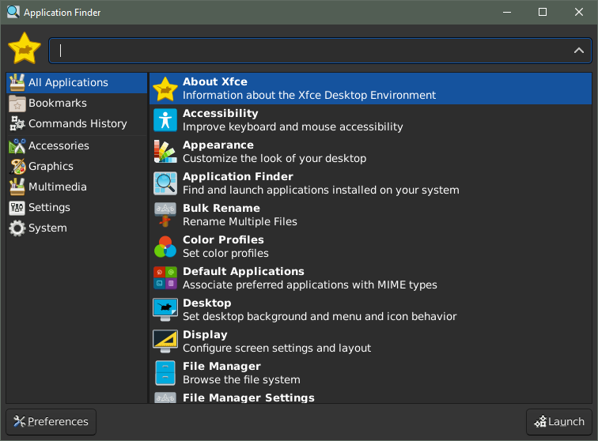

XFCE4 launcher for WSL
----------------------

Files and instructions to create a hotkey launched xfce4-appfinder for WSL distros with [XFCE4](https://xfce.org/) installed.  The directions are using [Pengwin](https://www.whitewaterfoundry.com/) but it should work for Ubuntu and Debian WSL distros as well.  Currently only Pengwin will install the latest XFCE4(4.16)

If you don't know what anything in the above text means this is probably not for you.  

**Requirements**
1. You have [WSL](https://docs.microsoft.com/en-us/windows/wsl/install-win10) installed (preferably WSL2) and know how to use it.
2. You have [AutoHotkey](https://www.autohotkey.com/) installed and know how to use it.
3. You have an X11 Server installed (e.g. I reccomend [X410](https://x410.dev/)) and have it set to windowed apps mode

**STEPS**
1. Launch the Pengwin terminal
2. Run the command ```pengwin-setup update``` to make sure all packages are up to date
3. Run the command ```sudo apt-get install xfce4 xfce4-terminal dbus-x11``` to install the required packages
4. Copy 00-xfce4.sh to /etc/profile.d in your Pengwin WSL instance
5. Terminate the WLinux WSL session with ```wsl -t WLinux```
6. Start your X11 server in windowed apps mode.  ***This must be done before your WSL instance starts so that the 00-xfce4.sh script can attach to your server properly during startup***.  If you don't, themes and other global settings won't be available to your X11 applications.
7. Run the wslstuff.ahk file in AutoHotKey (double click wslstuff.ahk).
8. Hit Win+Space and hopefully the xfce4-appfinder is now showing on your screen. *The first time you are launching might require you to hit Win+Space a second time for it to launch depending on the distro you are using.*

Hopefully a window will pop up that looks like below.


